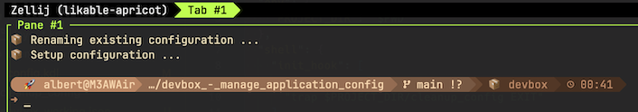

[](https://www.jetify.com/devbox/docs/contributor-quickstart/)
# Devbox - manage application config

_Note_: This repo is only for testing [Devbox](https://www.jetify.com/devbox/docs/) with application configuration files that need to be placed in the root of the user. [zellij](https://zellij.dev/) was used as sample application, the configuration of zellij is just an example.

[Devbox](https://www.jetify.com/devbox/docs/) generates isolated, reproducible development environments using the Nix package manager.

[zellij](https://zellij.dev/) is a terminal workspace similar to `tmux` or `screen`. It uses a configuration file that resides in the root of the users home directory (`.config/zellij/config.kdl`).

Devbox has no means to manage configuration files outside the sandbox-directory.

By using the "init_hook" and the bash trap-exit mechanism it is possible to add a default configuration and remove it after exiting the Devbox shell.

## Current setup

The current setup looks for an existing configuration directory and renames it to `<config>_backup`. In the next step the application configuration is copied from the Devbox environment to the users home directory.

On `exit` (closing the Devbox environment) the previous environment is restored.

This setup "enforces" all users to use the same configuration.

## Alternative setup

The alternative setup would be to use the existing application configuration.

This setup would allow users, who are already using the application, to use their own configuration.

## Bugfixes

### File not found

Changing directories caused a "file not found" error in the initial version. This was fixed with the "PROJECT_DIR" environment variable.

### zellij runs devbox `init_hook`

Maybe a bug, maybe not. When the `init_hook` is used in Devbox(.json) zellij calls the `init_hook` commands.

By default I'm running `zsh` on my Mac. Zellij, unless configured, runs the same shell as the host therefore also `zsh`. Same result when configuring the shell to `zsh` in zellij's `config.kdl`.

Starting Devbox from `zsh` and processing the `init_hook`


Starting `zellij` with `zsh` and processing the `init_hook`


Starting `zellij` with `bash` and not processing the `init_hook`


**Workaround A:**

Configure the default zellij shell to `bash`.

**Workaround B:**

Use the solution provided in the alternative `devbox_workaround.json` file. This can be used in two ways, starting `devbox shell` and call `zellij` from the command line. This method uses the default configuration from the Devbox environment.
The second way is to run the `zconf` script, `devbox run zconf`. This method copies the configuration to the users HOME directory and runs `zellij` directly.

```json
{
  "$schema":  "https://raw.githubusercontent.com/jetify-com/devbox/0.12.0/.schema/devbox.schema.json",
  "packages": ["zellij@latest"],
  "env": {
    "PROJECT_DIR": "$PWD",
    "ZELLIJ_CONFIG_DIR": "$PWD/zellij"
  },
  "shell": {
    "scripts": {
      "zconf": [
        "unset ZELLIJ_CONFIG_DIR",
        "./setup_config",
        "zellij",
        "trap $PROJECT_DIR/cleanup_config EXIT"
      ]
    }
  }
}
```
